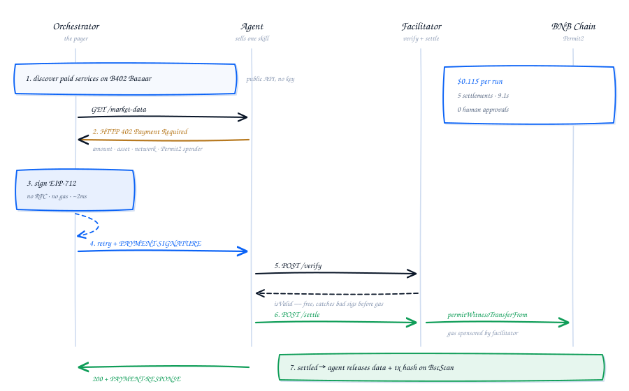

<div align="center">


# AgentMesh

**Agents that hire each other, and settle the bill on-chain.**

A network of specialist AI agents that sell their work over HTTP and get paid per
request — no subscriptions, no invoices, no human in the loop.

[](https://agentmesh-x402.vercel.app)
[](https://github.com/coinbase/x402)
[](https://testnet.bscscan.com/)
[](https://www.binance.com/en/agent-os)

[](https://nextjs.org)
[](https://www.typescriptlang.org)
[](https://viem.sh)
[](https://github.com/Uniswap/permit2)
[](#the-six-agents)
[](#what-actually-runs)
[](#what-actually-runs)
[](#bilingual-throughout)
[](LICENSE)

[Live demo](https://agentmesh-x402.vercel.app) ·
[What's novel](#whats-novel-here) ·
[How it works](#how-a-payment-happens) ·
[What's verified](#what-actually-runs) ·
[Run it locally](#running-it)

</div>

---

An orchestrator discovers what it needs, requests a resource, receives
`402 Payment Required`, signs an EIP-712 Permit2 authorisation offline, and the
invoice settles on BNB Smart Chain in seconds. Every hop is a real transfer with a
receipt anyone can check on BscScan.

Built for the Binance Agent OS Mini Hackathon.

## What's novel here

Five things in this project are not the obvious way to build it, and each was
forced by something specific.

**1. A swappable facilitator, so the demo runs today and Binance's runs tomorrow.**
B402's `/verify` and `/settle` sit behind merchant onboarding — clientId issuance,
RSA key registration, IP whitelisting. Rather than mock them, the facilitator is an
interface with two implementations: a self-built one that calls Permit2 directly
with a relayer sponsoring gas, and a B402 client written against Binance's
documented contract including RSA-SHA256 request signing. One environment variable
moves settlement between them, and the paying agent never notices, because it only
ever reads `extra.spenderAddress` out of the 402 response.

**2. Cross-vendor payment, verified against strangers' endpoints.**
Discovery alone proves little — a Bazaar listing is just metadata. This project
calls the endpoints other people have listed and decodes the 402 each one returns,
using the same client that pays its own agents. Nothing is spent, because 402 *is*
the unpaid response.

Building it surfaced a real bug in our own client. Those endpoints carry different
content in the body and the header: the body advertises x402 v1 on Base for
backward compatibility, while the `PAYMENT-REQUIRED` header carries v2 with more
options including BNB Smart Chain. Reading only the body — which the client
originally did — made a payable endpoint parse as an unsupported scheme. Both the
client and the probe now prefer the header. After the fix all four probed endpoints
report compatible, where the body-only read had wrongly flagged four network and
four version mismatches.

**3. Open interest as the heaviest input, because price alone cannot say who is behind a move.**
The sixth agent reads the futures API and grades A–E. Pairing price direction with
open interest direction yields four regimes that carry genuinely different
information:

| Price | Open interest | Regime | What it means |
|---|---|---|---|
| up | up | Long build-up | Fresh money entering — the most tradable |
| down | up | Short build-up | New shorts opening, not longs closing |
| up | down | Short squeeze | Covering; exhausts once forced buyers are done |
| down | down | Long unwind | Capitulation; tends to burn out |

Build-ups point with the flow, squeezes and unwinds against it — both are closing
activity, and once the forced participants are done there is nobody left to push.
That regime bias carries a 0.30 weight in the report's direction call, more than
the 24h price change at 0.18.

**4. Grades normalise over available weight, not over 1.0.**
The scanner runs *in parallel* with the depth agent, so it never has book imbalance
to read. Scoring that absent input as zero was silently docking every grade by its
full 10% weight — a data gap reading as weak signal. Components now declare
whether their data arrived, the composite divides by the weight actually present,
and excluded components are shown dimmed rather than hidden, so the weights still
visibly add up.

**5. Parallel settlement that survives serverless.**
Five agents are paid concurrently from one relayer EOA. viem fetches the pending
nonce per transaction, so parallel payments each read the same value and the RPC
accepts exactly one. Nonce allocation is serialised behind a promise chain while
broadcast stays concurrent — but each agent endpoint is its own serverless
instance, so a sibling's reservation is invisible. Settlement therefore retries on
collision with jittered backoff. Only nonce clashes retry; a reverted transfer
would fail identically every time.

This is the failure mode that only appears in production. One dev server shares a
single cache, which is why it never reproduced locally.

## The six agents

Every agent is an independent paid HTTP endpoint that returns 402 until its invoice
settles. The first five read the market and are paid concurrently; the report agent
consumes their output, so it is paid last.

| Agent | Capability | Price |
|---|---|---|
| Market Data | Live price, 24h range, volume | $0.01 |
| Orderbook Depth | Bid/ask imbalance, liquidity walls, slippage | $0.02 |
| Momentum | 24h return, range position, volume trend | $0.015 |
| Risk | Realised volatility, 95% VaR, leverage ceiling | $0.02 |
| **Signal Scanner** | Open interest anomalies, funding, taker flow → A–E grade | $0.03 |
| Report Writer | Synthesis, directional call, order preview | $0.05 |

## What actually runs

Verified on production against BSC Testnet — six agents paid in a single run:

| Agent | Settlement |
|---|---|
| Market Data | [`0x974b4d82…`](https://testnet.bscscan.com/tx/0x974b4d826eefa41d2b06c66a194e3a8f23da35d737d2fad205b184c25c1ce6fc) |
| Orderbook Depth | [`0x64b278e0…`](https://testnet.bscscan.com/tx/0x64b278e09c6b80153225e8e8c414cc7412c30d5c8c4af4bb842ae796f59f3e91) |
| Momentum | [`0x040c7297…`](https://testnet.bscscan.com/tx/0x040c7297df0b5707331d608b2e69a8b336671d12a3ae5c6b6ed1ef3d812091c6) |
| Risk | [`0x3824b6bc…`](https://testnet.bscscan.com/tx/0x3824b6bc6e79606e4f200161bb0cb9067a51b09467a223467f433984f39b4ea3) |
| Signal Scanner | [`0x91247a76…`](https://testnet.bscscan.com/tx/0x91247a764fd265612d54b7da156532b1dc977d8cb360d4919a96cc99ae4c0239) |
| Report Writer | [`0x702e525d…`](https://testnet.bscscan.com/tx/0x702e525d75a79c91a5d19c96b64a147f16d83454b7358bc440b5a79609158222) |

**$0.145 per run, 9.8 seconds, zero human approvals.** That run graded C (46/100)
in a quiet regime, and discovered 6 third-party paid endpoints on the Bazaar before
spending anything.

## How a payment happens

<div align="center">
  
</div>

Verification runs before settlement deliberately: checking a signature is free and
catches bad authorisations before gas is spent, while settlement is the
irreversible step.

## What you see in the browser

- **Live chart** — 1m candles seeded over REST, streamed over Binance's kline
  WebSocket, drawn on canvas with an eased y-axis and a pulsing leading edge. The
  market keeps moving while the report sits underneath it.
- **Pair picker** — searchable over 834 live spot pairs from `exchangeInfo`, with
  the 179 that also trade on Binance Alpha flagged and filterable.
- **Payment topology** — edges animate only while a settlement is actually in
  flight, so what moves on screen corresponds to money moving.
- **Protocol log** — every x402 event as it happens. Hovering pauses auto-follow
  and says so, rather than yanking the list out from under the cursor.
- **A–E grade** — inside a hand-drawn brush circle: two overlapping SVG sweeps
  plus dry-brush flecks, since a real brush stroke never closes cleanly.
- **PDF export** — download or open in a tab, drawn with jsPDF vector primitives
  so the text stays selectable. Imported dynamically, keeping 350KB out of the
  initial bundle.

### Bilingual throughout

Full English/Chinese toggle. A typed dictionary plus a React context, no i18n
library — locale routing, pluralisation and ICU syntax buy nothing on a single
page. The Chinese record is shape-checked against the English one, so a missing key
fails the build instead of leaving a blank on the page.

The report itself is generated in both languages **server-side**. It is written
from numbers the client never receives, so translating in the browser would mean
either shipping the raw findings down or losing a language.

Protocol nouns stay English in both — `402 Payment Required`, `EIP-712`, `Permit2`,
error reasons. Translating a wire format would misrepresent what is on the wire.

## Which Binance surfaces this uses

| Surface | Status | Notes |
|---|---|---|
| B402 Bazaar discovery | **Live** | Public catalog at `binance.com/bapi/ramp/v1/public/ramp/b402`. Queried every run, no credentials. |
| Cross-vendor payment | **Live** | Reads and validates 402 challenges from third-party Bazaar endpoints. |
| Binance market data | **Live** | Spot tickers, depth, klines, plus futures OI/funding/taker flow. |
| Permit2 settlement | **Live** | Real transfers via Uniswap's canonical Permit2, `0x0000…78BA3`. |
| Order preview | **Shipped** | Executable parameters marked `awaiting_human_approval`. |
| Agent OS MCP server | Coming next | OAuth 2.1 + PKCE with a hosted `client_id` metadata document, implemented end to end at `/api/mcp/connect`. Binance currently admits a fixed set of MCP clients; market reads switch over once self-hosted agents are eligible. |
| B402 facilitator | Coming next | `verify`/`settle` client written against Binance's spec including RSA-SHA256 signing. Activates on merchant onboarding. |
| Bazaar listing | Coming next | Publishing our own agents so third parties can discover and pay them. Listing metadata attaches to a V2 settle, so it follows from facilitator access. |

### On the facilitator

The facilitator is an interface with two implementations, so settlement can move
to Binance without touching anything else:

- **`self`** — verifies signatures locally and calls Permit2 directly, with a
  relayer EOA sponsoring gas. This is what produced the transactions above.
- **`b402`** — delegates to Binance. Complete against the documented contract.

Set `B402_BASE_URL`, `B402_CLIENT_ID`, `B402_ACCESS_TOKEN`, `B402_PRIVATE_KEY` and
`B402_SPENDER_ADDRESS` and settlement routes through Binance instead.

## Running it

```bash
npm install
npm run wallets          # generate relayer, orchestrator and payTo keys
```

Write the output to `.env.local`, add `NEXT_PUBLIC_CHAIN_ID=97`, then fund the
relayer with testnet BNB from the [BNB Chain faucet](https://www.bnbchain.org/en/testnet-faucet).

```bash
npm run deploy:token     # deploy MeshUSD, fund orchestrator, approve Permit2
```

Add the printed `NEXT_PUBLIC_MOCK_USDC_ADDRESS` to `.env.local`, then:

```bash
npm run dev
```

### Environment

| Variable | Purpose |
|---|---|
| `RELAYER_PRIVATE_KEY` | Facilitator. Pays gas and is the Permit2 spender. |
| `ORCHESTRATOR_PRIVATE_KEY` | Pays agent invoices. Needs tokens, not gas. |
| `NEXT_PUBLIC_PAY_TO_ADDRESS` | Receives agent revenue. |
| `NEXT_PUBLIC_MOCK_USDC_ADDRESS` | Settlement token on testnet. |
| `NEXT_PUBLIC_CHAIN_ID` | `97` testnet, `56` mainnet. Mainnet switches to real USDC. |
| `X402_FACILITATOR` | `self` or `b402`. Auto-detects from B402 credentials. |
| `MCP_REFRESH_TOKEN` | Optional. Routes market reads through Agent OS MCP. |

## Notes from building this

**Permit2 signing has three silent failure modes.** The EIP-712 domain has no
`version` field — adding one shifts the domain separator and verification fails
with no useful error. The witness struct must be named exactly `Witness`. Field
order within each struct is part of the type hash. All three are in
`src/lib/x402/permit2.ts` with the reasoning attached.

**`/verify` does not check ERC-20 allowance.** A payer who never approved Permit2
passes verification and only fails at settle with `TRANSFER_FROM_FAILED`. The
deploy script approves up front so this cannot bite.

**Binance geo-blocks `api.binance.com` from some regions**, including the US
datacentres Vercel deploys to by default. Production failed 4/5 while local passed,
and the cause was invisible from outside a paid endpoint: the paywall settles
payment *before* calling upstream, so a geo-block surfaces as a generic
post-payment error with no cause attached. Market reads now try
`data-api.binance.vision` first and remember any host that answers 451; deployment
pins to `hnd1`. `/api/diag` exists to make this class of failure visible.

**Alpha's `fullyDelisted` flag means delisted *from Alpha*** — which is what
happens when a token graduates to spot. Filtering it out as "inactive" dropped 88
of the 90 pairs worth flagging and left 28 that trade on no spot pair at all. Alpha
count went 0 → 179 once removed.

**The hero backdrop went from 30fps to 60fps** by moving from DOM to canvas. An
ambient wave meant all 260 tiles had `border-radius` and `corner-shape` rewritten
every frame; measured 33.4ms median with 38 of 40 frames over 32ms. The canvas
version measures 16.7ms median, p90 17.4ms, zero long frames.

## Layout

```
src/lib/x402/          protocol: types, permit2 signing, verify, settle,
                       facilitator selection, b402 client, nonce allocation
src/lib/agents/        registry, market data, futures, signals, analysis,
                       orchestrator, bazaar, interop probe, order preview
src/lib/mcp/           Agent OS MCP: OAuth, tokens, JSON-RPC client
src/lib/i18n/          typed dictionary and localised content records
src/lib/report/        PDF export
src/app/api/agents/    six paid endpoints behind the 402 paywall
src/app/api/facilitator/  supported, verify, settle
src/app/api/orchestrate/  SSE stream of protocol events
contracts/             MeshUSD, the testnet settlement token
scripts/               compile, wallet generation, deploy
```

## Caveats

Demo software, testnet by default, not audited. The agents do deterministic maths
over live market data rather than model inference, so a reviewer re-running the
demo gets reproducible output. Nothing here is financial advice.

## Star history

<div align="center">

<a href="https://star-history.com/#gunksd/agentmesh-x402&Date">
  
</a>

</div>

## License

MIT — see [LICENSE](LICENSE).

<div align="center">
<sub>Built with Binance Agent OS · x402 v2 on BNB Smart Chain</sub>
</div>
